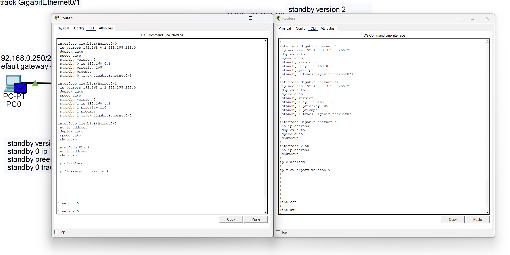
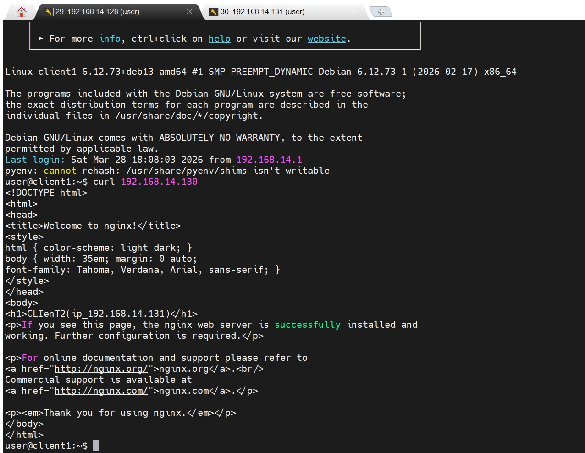
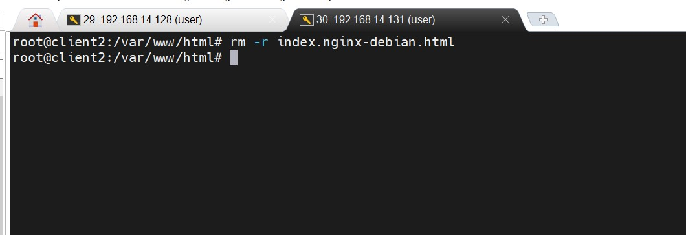
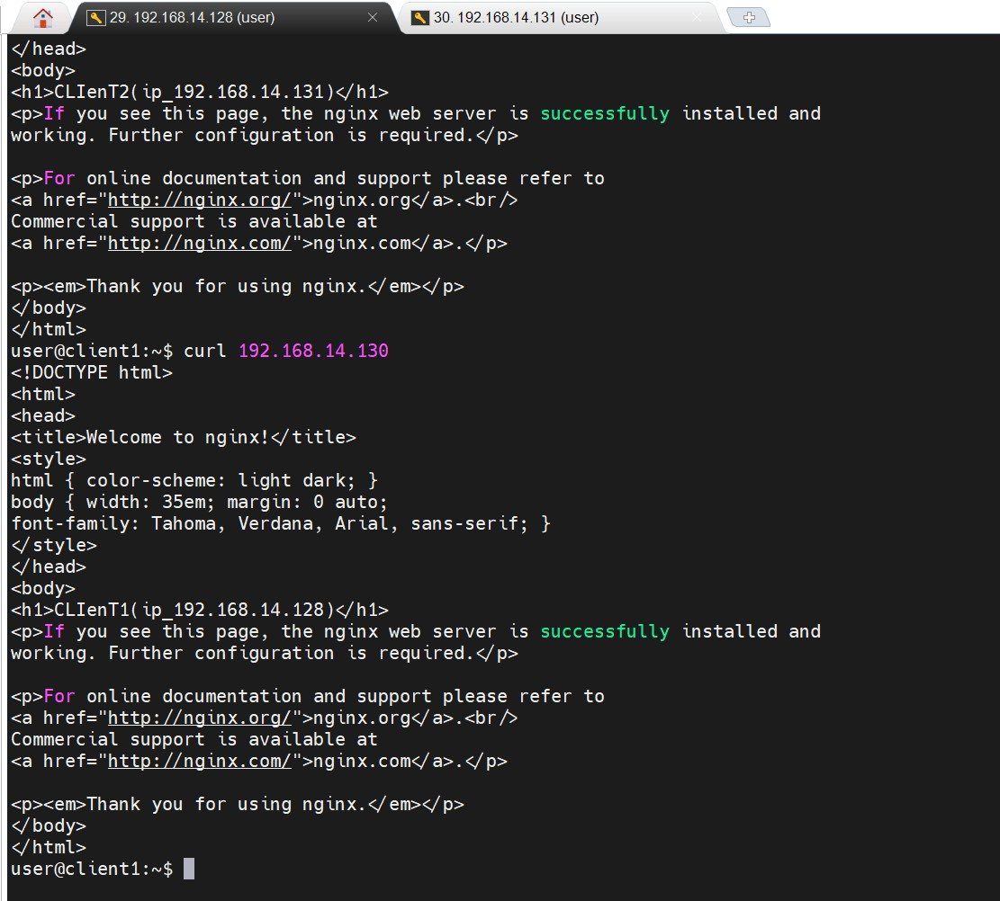
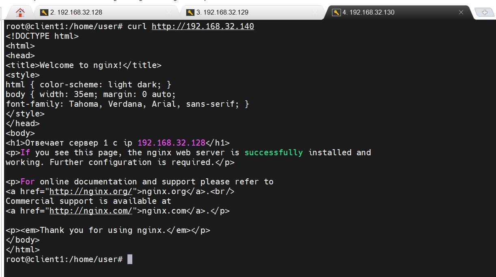

# Домашнее задание к занятию 1 «Disaster recovery и Keepalived» - Бобков Александр

## Задание 1
- Дана схема для Cisco Packet Tracer, рассматриваемая в лекции.
- На данной схеме уже настроено отслеживание интерфейсов маршрутизаторов Gi0/1 (для нулевой группы)
- Необходимо аналогично настроить отслеживание состояния интерфейсов Gi0/0 (для первой группы).
- Для проверки корректности настройки, разорвите один из кабелей между одним из маршрутизаторов и Switch0 и запустите ping между PC0 и Server0.
- На проверку отправьте получившуюся схему в формате pkt и скриншот, где виден процесс настройки маршрутизатора.

### ОТВЕТ:
* Схема во вложении [схема](./hsrp_advanced_DZ.pkt)
<summary>Скриншот настройки маршрутизаторов</summary>


------


## Задание 2
- Запустите две виртуальные машины Linux, установите и настройте сервис Keepalived как в лекции.
- Настройте любой веб-сервер (например, nginx или simple python server) на двух виртуальных машинах
- Напишите Bash-скрипт, который будет проверять доступность порта данного веб-сервера и существование файла index.html в root-директории данного веб-сервера.
- Настройте Keepalived так, чтобы он запускал данный скрипт каждые 3 секунды и переносил виртуальный IP на другой сервер, если bash-скрипт завершался с кодом, отличным от нуля (то есть порт веб-сервера был недоступен или отсутствовал index.html). Используйте для этого секцию vrrp_script
- На проверку отправьте получившейся bash-скрипт и конфигурационный файл keepalived, а также скриншот с демонстрацией переезда плавающего ip на другой сервер в случае недоступности порта или файла index.html


------

### ОТВЕТ:
**Скрипт (данный скрипт нужно разместить на основном сервере и на резервном):**
```bash
#!/bin/bash

# 1. Проверяем наличие процесса nginx (через pidof)
if ! pidof nginx > /dev/null; then
    exit 1
fi

# 2. Проверяем, слушает ли веб-сервер порт 80
if ! ss -tulpn | grep -q ":80 "; then
    exit 1
fi

# 3. Проверяем наличие файла в root-директории
# (Имя файла должно совпадать с тем, что лежит в /var/www/html/)
if [ ! -f /var/www/html/index.nginx-debian.html ]; then
    exit 1
fi

# Если все три проверки прошли успешно, возвращаем 0
exit 0
```
**В скрипте дополнительно настроена проверка процесса сервиса NGINX используя команду [`pidof`](https://linuxcookbook.ru/articles/komanda-pidof-linux)**

<details>
<summary>Конфигурационный файл keepalived на сервере:</summary>

```conf
global_defs {
    script_user root # от имени какого пользователя выполнять проверку /etc/keepalived/check_web.sh
    enable_script_security # Разрешаем запуск внешних скриптов (безопасность)
}

# 1. Описываем  скрипт проверки
vrrp_script check_script {
    script "/etc/keepalived/check_web.sh" # Путь к скрипту
    interval 3                            # Проверка каждые 3 секунды
    fall 2                                # Количесвто провалов для смены статуса
    rise 2                                # Количество успешных проверок для возврата
}

# 2. Описываем экземпляр VRRP
vrrp_instance VI_1 {
    state MASTER             # На втором сервере будет BACKUP
    interface ens33           # Имя  сетевого интерфейса (ip a)
    virtual_router_id 51     # Должен быть одинаковым на обеих машинах
    priority 100             # На BACKUP сервере будет 90
    advert_int 1             # Сообщает BACKUP серверу что живой каждую секунду

    # Пароль для связи между серверами (можно и без него)
    authentication {
        auth_type PASS
        auth_pass 12345
    }

    # Плавающий IP, который будет переезжать
    virtual_ipaddress {
        192.168.14.130        # Свободный IP из моей подсети
    }

    # 3. Привязываем скрипт к этому инстансу
    track_script {
        check_script
    }
}
```
</details>


<details>
<summary>Конфигурационный файл keepalived на резервном сервере:</summary>

```conf
global_defs {
    script_user root  # от имени какого пользователя выполнять проверку /etc/keepalived/check_web.sh
    enable_script_security # Разрешаем запуск внешних скриптов (безопасность)
}

# 1. Описываем  скрипт проверки

vrrp_script check_script {
    script "/etc/keepalived/check_web.sh"
    interval 3                            # Проверка каждые 3 секунды
    fall 2                                # Количесвто провалов для смены статуса
    rise 2                                # Количество успешных проверок для возврата

}
	# 2. Описываем экземпляр VRRP

vrrp_instance VI_1 {
    state BACKUP              # ОТЛИЧИЕ 1: тут BACKUP
    interface ens33            # Имя должно совпадать с моим интерфейом (ip a)
    virtual_router_id 51      # Должен быть ТАКИМ ЖЕ, как на Master
    priority 90               # ОТЛИЧИЕ 2: ниже, чем на Master (там 100)
    advert_int 1              #сервер будет слушать  Master сервер каждую 1 секунду

	# Пароль для связи между серверами (можно и без него)

    authentication {
        auth_type PASS
        auth_pass 12345
    }
	# Плавающий IP, который будет переезжать

    virtual_ipaddress {
        192.168.14.130         # Тот же самый плавающий IP
    }
	# 3. Привязываем скрипт к этому инстансу

    track_script {
        check_script          # Cкрипт должен быть на обоих срверах обязательно!
    }
}
```
</details>


<summary>Штатная работа сервера (его ip 192.168.14.131)</summary>


<summary>Удаляем отслеживаемый файл с сервера (его ip 192.168.14.131)</summary>


<summary>Видим, что стал отвечать резервный сервер (его ip 192.168.14.128)</summary>


--------

### Задание 3*
- Изучите дополнительно возможность Keepalived, которая называется vrrp_track_file
- Напишите bash-скрипт, который будет менять приоритет внутри файла в зависимости от нагрузки на виртуальную машину (можно разместить данный скрипт в cron и запускать каждую минуту). Рассчитывать приоритет можно, например, на основании Load average.
- Настройте Keepalived на отслеживание данного файла.
- Нагрузите одну из виртуальных машин, которая находится в состоянии MASTER и имеет активный виртуальный IP и проверьте, чтобы через некоторое время она перешла в состояние SLAVE из-за высокой нагрузки и виртуальный IP переехал на другой, менее нагруженный сервер.
- Попробуйте выполнить настройку keepalived на третьем сервере и скорректировать при необходимости формулу так, чтобы плавающий ip адрес всегда был прикреплен к серверу, имеющему наименьшую нагрузку.
- На проверку отправьте получившийся bash-скрипт и конфигурационный файл keepalived, а также скриншоты логов keepalived с серверов при разных нагрузках

## ОТВЕТ:

- Скрипт:

```bash
#!/bin/bash

# --- НАСТРОЙКИ ПУТЕЙ И ПЕРЕМЕННЫХ ---

# Указываем путь к итоговому файлу, который будет читать Keepalived
TRACK_FILE="/etc/keepalived/vrrp_priority"

# Указываем путь к временному файлу (нужен для безопасной "атомарной" записи)
TEMP_FILE="/etc/keepalived/vrrp_priority.tmp"

# Устанавливаем базовое число приоритета для абсолютно свободного сервера
# VRRP позволяет значения от 1 до 254. 250 — отличный запас.
BASE_PRIO=250

# --- ПОЛУЧЕНИЕ ДАННЫХ О НАГРУЗКЕ ---

# Команда uptime выдает строку с Load Average. Мы вырезаем первое число (за 1 минуту).
# awk разделяет строку по метке 'load average:', берет правую часть, а cut забирает число до первой запятой.
LOAD=$(uptime | awk -F'load average:' '{ print $2 }' | cut -d, -f1 | xargs)

# --- ПРЕВРАЩЕНИЕ ТЕКСТА В ЧИСЛО ---

# Bash не умеет работать с дробями (0.35), поэтому мы убираем точку: "0.35" -> "035"
# Команда tr -d '.' просто стирает символ точки.
LOAD_WITHOUT_DOT=$(echo "$LOAD" | tr -d '.')

# Если в начале числа остались нули (например, "035"), Bash может запутаться.
# Команда sed 's/^0*//' удаляет все нули в самом начале строки: "035" -> "35"
LOAD_NUM=$(echo "$LOAD_WITHOUT_DOT" | sed 's/^0*//')

# Если нагрузка была 0.00, то после удаления точек и нулей переменная станет пустой.
# Эта проверка [ -z ... ] ставит 0, если в переменной пусто, чтобы расчет не сломался.
[ -z "$LOAD_NUM" ] && LOAD_NUM=0

# --- РАСЧЕТ ИТОГОВОГО ПРИОРИТЕТА ---

# Вычитаем очищенное число нагрузки из базового приоритета.
# Пример: 250 (база) - 35 (нагрузка 0.35) = 215 (новый приоритет)
NEW_PRIO=$((BASE_PRIO - LOAD_NUM))

# --- ПРОВЕРКА ГРАНИЦ VRRP ---

# По стандарту VRRP приоритет не может быть меньше 1.
if [ "$NEW_PRIO" -lt 1 ]; then
    NEW_PRIO=1
fi

# По стандарту VRRP приоритет не может быть больше 254.
if [ "$NEW_PRIO" -gt 254 ]; then
    NEW_PRIO=254
fi

# --- БЕЗОПАСНАЯ (АТОМАРНАЯ) ЗАПИСЬ ---

# Сначала записываем итоговое число во временный файл.
echo "$NEW_PRIO" > "$TEMP_FILE"

# Мгновенно заменяем рабочий файл временным. 
# Это гарантирует, что Keepalived не прочитает файл в момент его перезаписи.
mv "$TEMP_FILE" "$TRACK_FILE"
```


### Установите Zabbix Agent на два хоста.
Процесс выполнения

    Выполняя ДЗ, сверяйтесь с процессом отражённым в записи лекции.
    Установите Zabbix Agent на 2 вирт.машины, одной из них может быть ваш Zabbix Server.
    Добавьте Zabbix Server в список разрешенных серверов ваших Zabbix Agentов.
    Добавьте Zabbix Agentов в раздел Configuration > Hosts вашего Zabbix Servera.
    Проверьте, что в разделе Latest Data начали появляться данные с добавленных агентов.

### Требования к результатам

    Приложите в файл README.md скриншот раздела Configuration > Hosts, где видно, что агенты подключены к серверу
    Приложите в файл README.md скриншот лога zabbix agent, где видно, что он работает с сервером
    Приложите в файл README.md скриншот раздела Monitoring > Latest data для обоих хостов, где видны поступающие от агентов данные.
    Приложите в файл README.md текст использованных команд в GitHub


## ОТВЕТ:

**Cкриншот раздела Configuration > Hosts:**


**Cкриншот лога zabbix agent:**	


   
**Cкриншот раздела Monitoring > Latest data:**


 
**Покажу еще панели (не стал менять ip для агента установленного на самом сервере zabbix):**


**Текст использованных команд**

1. **Устанавливаем сам Агент:**

```bash
apt update && apt install zabbix-agent -y
```
2. **Правим конфигурационный файл:** `nano /etc/zabbix/zabbix_agentd.conf`

```ini
ServerActive=10.129.0.5 — IP сервера (куда агент сам шлет данные);
Hostname=zabbixclient — это имя должно точно совпадать с полем "Host name" в веб-интерфейсе Zabbix.
Server=10.129.0.5 — для пассивных проверок (чтобы сервер мог опрашивать агент).
```
3. **Произодим рестарт сервиса Агента:**

```bash
systemctl restart zabbix-agent
```

4. **Добавляем сервис в автозагрузку:**

```bash
systemctl enable zabbix-agent
```

##### Столкнулся с проблемой, т.к. виртульная машина развернута в YandexCloud, на сервере Zabbix были включены правила iptables, из за чего не проходили пакеты на порт 10051, на нем Zabbix слушает информацию от Агентов, это нужно в томслучае, если Агент отсылает информаицю в Zabbix, а не только Zabbix запрашивает информацию от Агента. Пришлось изменить правила iptables.


